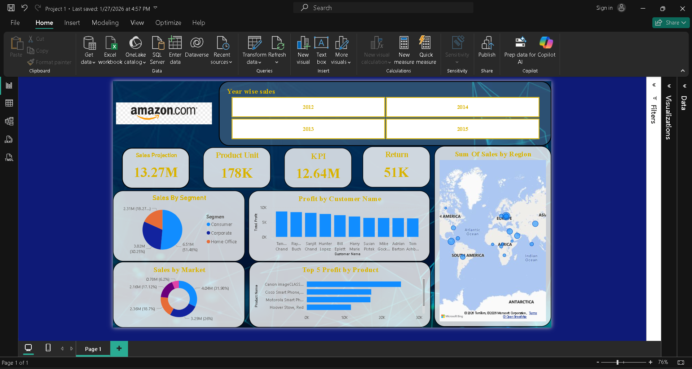

# 📊 Power BI Dashboard — Amazon Global Sales Analysis

## 🧠 Project Overview
This project presents an interactive Power BI dashboard analyzing global sales performance across multiple years, regions, products, and customer segments. The dashboard provides insights into revenue trends, profitability, and market performance to support data-driven business decisions.

---

## 🎯 Objectives

- Analyze sales and profit trends over time
- Identify top-performing products and regions
- Evaluate customer segment contributions
- Monitor key performance indicators (KPIs)
- Enable interactive exploration using filters and slicers

---

## 🛠️ Tools & Technologies Used

- Power BI Desktop
- Data Modeling
- DAX (Data Analysis Expressions)
- Microsoft Excel (Data Source)

---

## 📈 Key Insights

- Identified the most profitable regions and products
- Analyzed year-over-year growth in sales and profit
- Discovered high-value customers and segments
- Highlighted underperforming areas for improvement

---

## 📊 Dashboard Features

✔ Interactive visualizations  
✔ KPI cards for quick performance tracking  
✔ Geographic map for regional analysis  
✔ Filters and slicers for dynamic exploration  
✔ Drill-down capability  

---

## 📷 Dashboard Preview

Screenshot 2026-03-26 110618.png

---

## 📂 Files Included

- `Amazon_Sales_Dashboard.pbix` — Power BI project file  
- `Dataset.xlsx` — Source data (if included)  
- `dashboard.png` — Dashboard screenshot  

---

## 🚀 How to Use

1. Download the `.pbix` file  
2. Open using **Power BI Desktop**  
3. Explore the dashboard using filters and slicers  

---

## 🔗 Project Link

👉 GitHub Repository: https://github.com/yourusername/project-name  

---

## 👨‍💻 Author

**Sahil Lendhe**  
Aspiring Data Analyst | AI/ML Engineer  

📧 sahillendhe2004@gmail.com  
🔗 LinkedIn: https://www.linkedin.com/in/sahil-lendhe-671b5930b  
💻 GitHub: https://github.com/sahil1000725  

---

⭐ If you found this project useful, consider giving it a star!

